# kaggle_introduction_to_nlp

This repository is created for participating in [Natural Language Processing with Disaster Tweets](https://www.kaggle.com/competitions/nlp-getting-started) competition.

NLP, seq2seq tasks are listed below:

* one to many
* one to one
* many to one
* many to many

This project aims to predict which Tweets are about real disasters and which ones are not.

## Data

The [data](https://www.kaggle.com/competitions/nlp-getting-started/data) is available on the related kaggle competition page. Text vectorization and embedding are done on the dataset.


Here you can see the random data sampled from dataset and their labels:


## Run

You can run the notebook on Colab, Kaggle or jupyter notebook.

Clone the project

```bash
  git clone https://github.com/BlakeAmory/DisasterTweets
```

## Results

Different models have been tested on the dataset including a baseline model to compare other models with. You can see the sample predictions in the figure below:

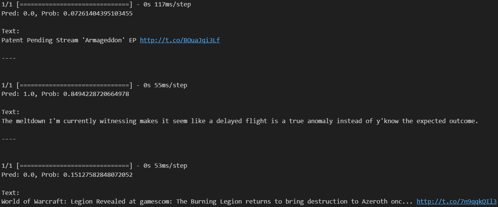

* Model_0: Naive bayes (baseline model)

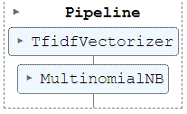

* Model_1: FFN

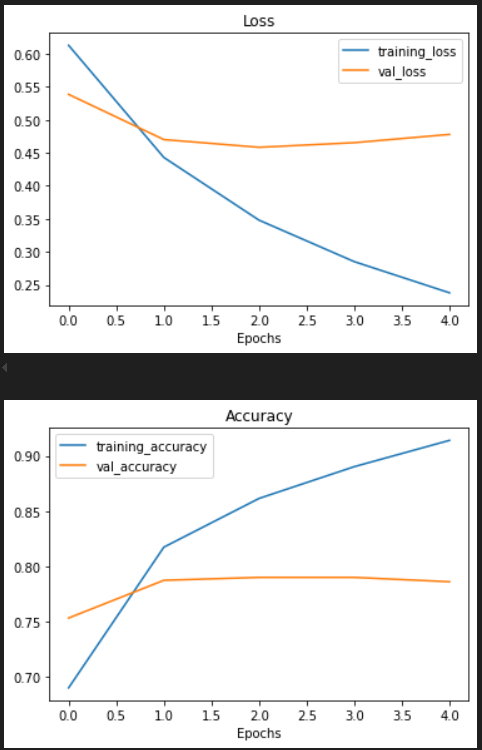

* Model_2: LSTM

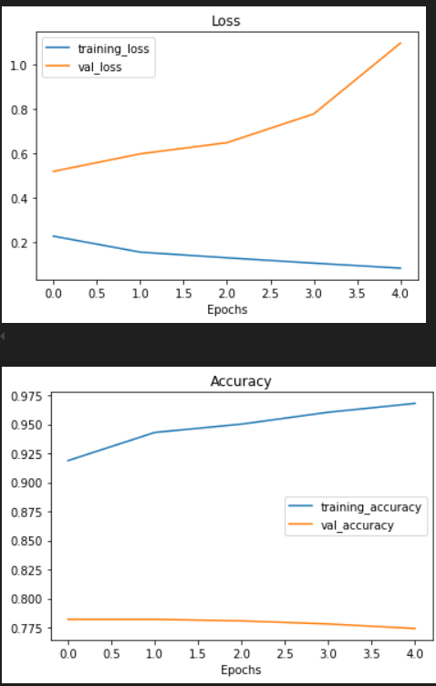

* Model_3: GRU

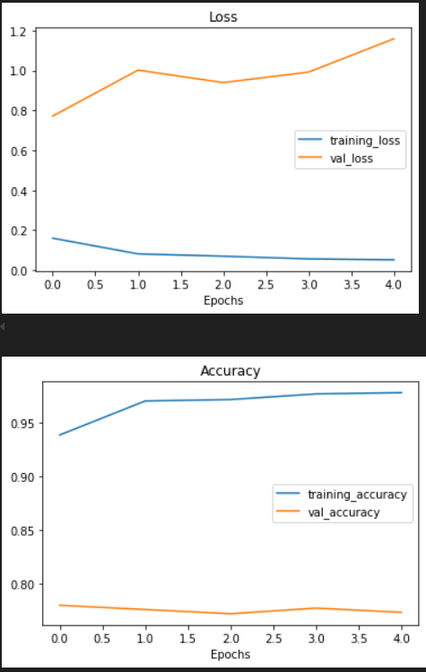

* Model_4: BI-LSTM


* Model_5: Conv1D


* Model_6: Tensorflow_hub transfer learning (Universal Sentence Encoder, USE, as the feature extractor)

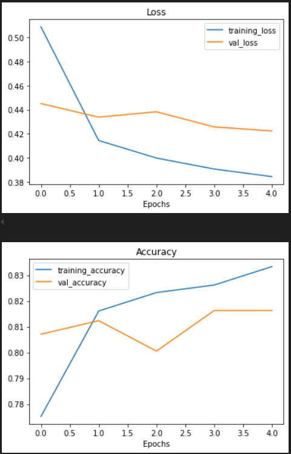

* Model_7: Transfer learning on 10% data

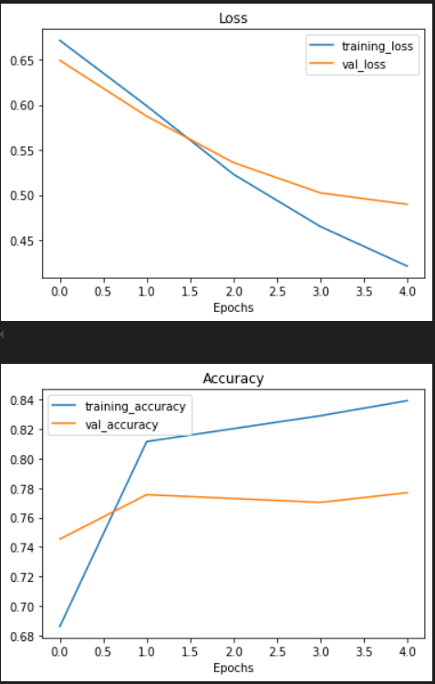

* Model_8: Sequential api FFN

* Model_9: LSTM sequential

* Model_10: Conv1D seq

* Model_11: Baseline retrain on 10% data

* model_12: Fine tuning tfhub USE model

* model_13: Ensemble model with LSTM model, Conv1D model and USE model.

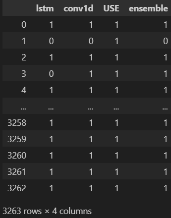

### Model comparison

These models are compared based on accuracy, f1-score, precision and recall.


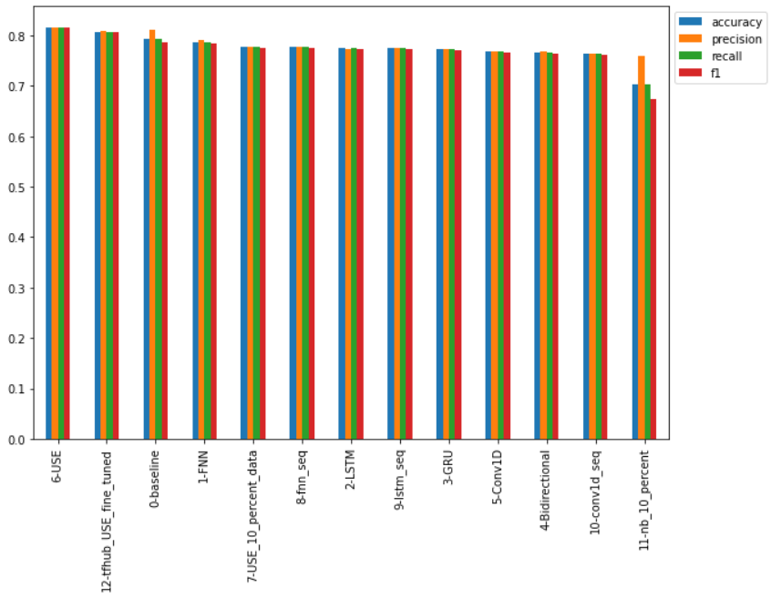

The models are sorted based on f1_score and the best model is identified.

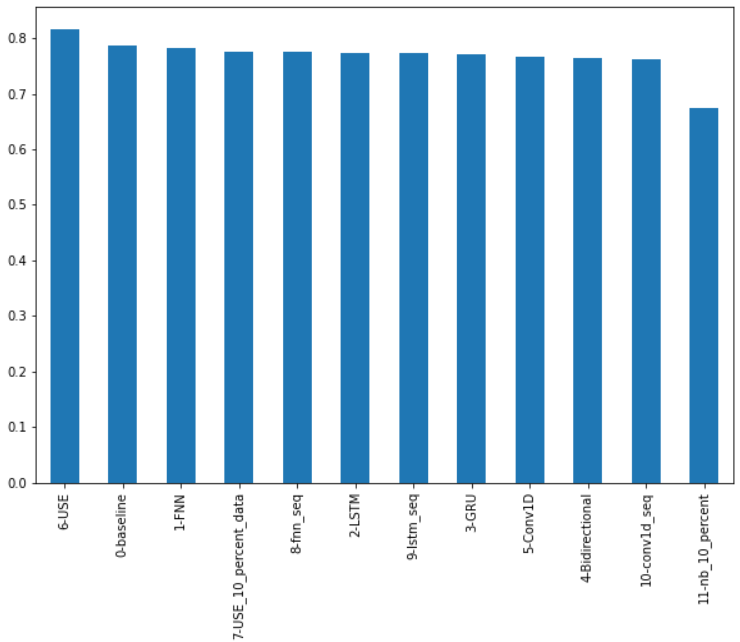

Best model is model_6 (tfhub USE on all data). Its confusion matrix is shown below:

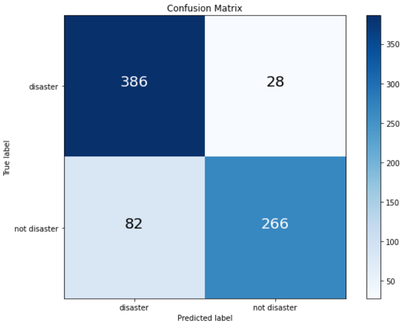

There has a tradeoff between speed and score of models. The baseline naive bayes model (model 11) shows better speed and the USE model (model 7) has better performance. Selection of the model depends on the use case and deployment. In the image below, model 7 and model 11 have been compared on 10 percent of data.

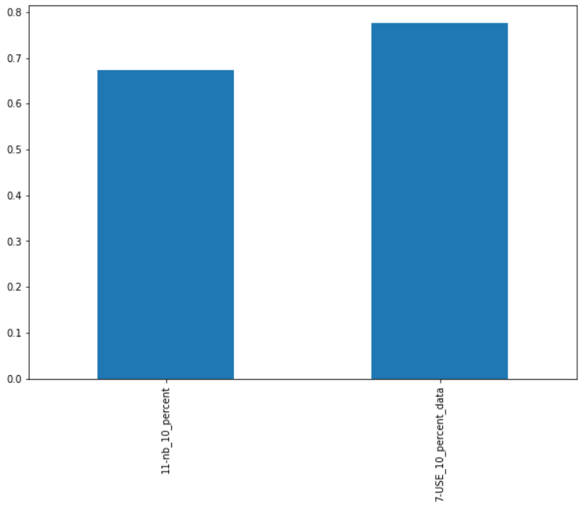

Finally the predictions are submitted to kaggle competition based on the specified format.

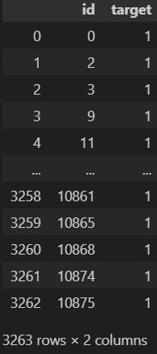

### Most wrong predictions

Identifying most wrong predictions can help us improve our model or detect some wrong labels in the dataset. Hers is the most wrong predictions that our model has done.

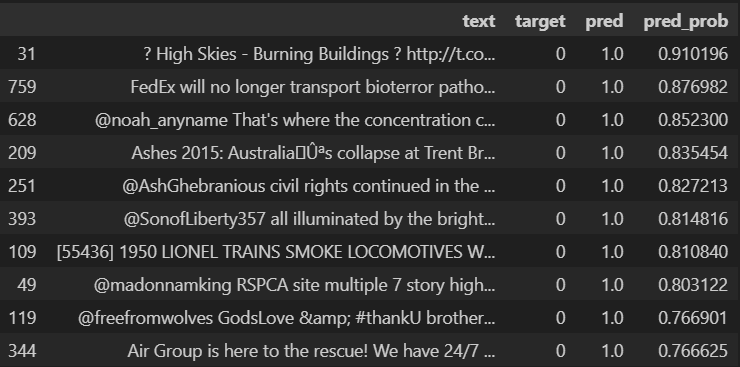

## Lessons Learned

* Using ensemble (stacking, blending, etc.) models can achieve good performance on textual data.
* There is a tradeoff between speed and score of different models that should be considered when deploying the models. Model 6 shows better performance (f1 score) but model 1 (baseline) is faster.

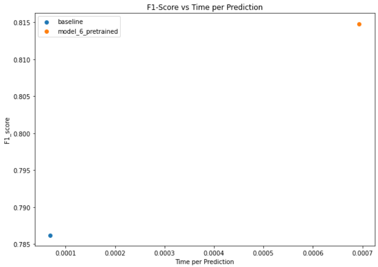

## License

This project is under MIT license:

[](https://choosealicense.com/licenses/mit/)
